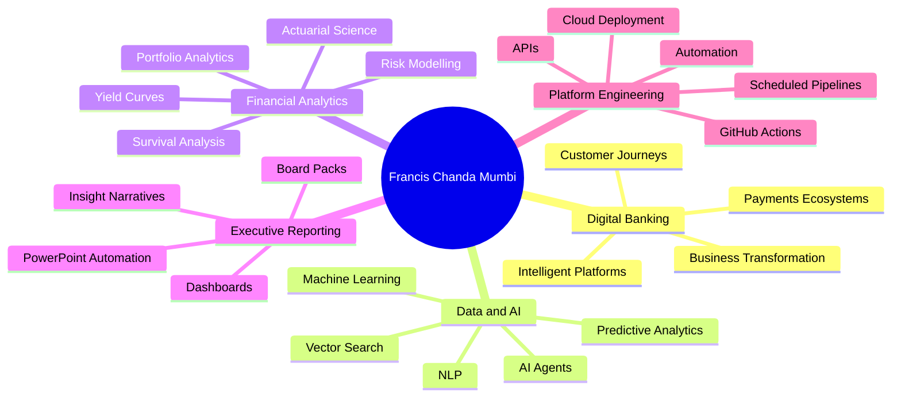
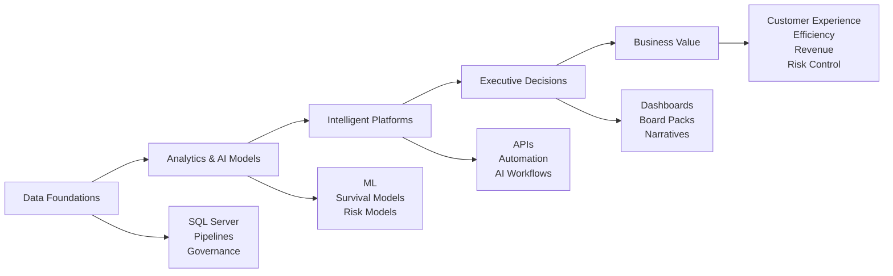
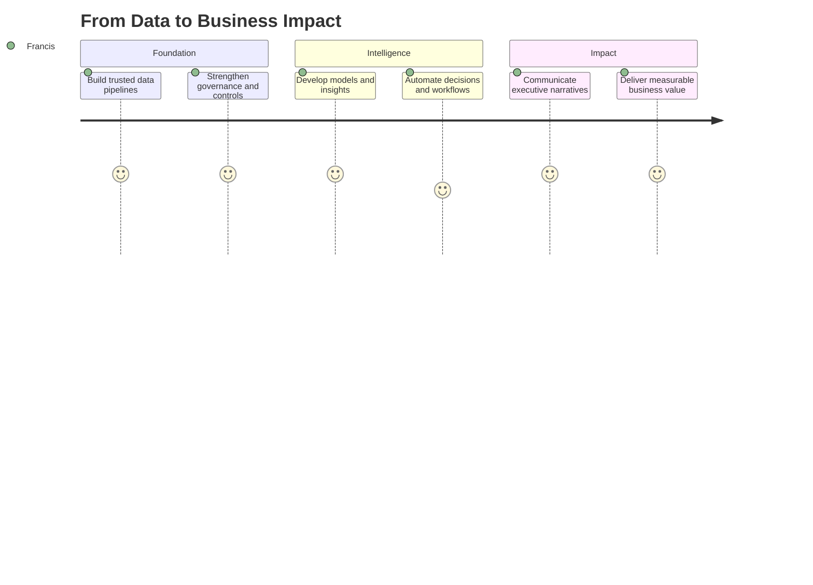

<!--
Profile README for Francis Chanda Mumbi
Recommended repository: FrancisChanda/FrancisChanda
Place optional banner image in: assets/profile_banner.png
-->

  

<h1 align="center">Hi, I'm Francis Chanda Mumbi 👋</h1>

<h3 align="center">
Digital Banking, Data & AI Executive | Financial Services Transformation | Intelligent Platforms | Analytics & Automation
</h3>

  
  
  

---

## 🚀 Executive Snapshot

I am a **Digital Banking, Data & AI Executive** with a strong blend of financial services experience, actuarial training, analytics leadership, and hands-on technology delivery. My work sits at the intersection of **banking transformation, intelligent platforms, payments ecosystems, automation, risk analytics, and value-focused innovation**.

With a background in **Actuarial Science, finance, data science, and software-enabled analytics**, I focus on turning complex business problems into scalable digital and analytical solutions. I build and shape **executive reporting platforms, AI-enabled workflows, automated data pipelines, financial models, survival and risk models, API services, and decision-support tools** for banking and enterprise environments.

> **Digital Banking, Data & AI Executive driving business transformation through intelligent platforms, payments ecosystems, and value-focused innovation.**

---

## 🧭 My Value Map

---

## 💼 What I Bring

| Capability | How I Create Value |
|---|---|
| 🏦 **Digital Banking & Business Transformation** | Driving digital initiatives, intelligent platforms, payments innovation, customer-focused transformation, and operating-model improvement within financial services. |
| 🤖 **Data, AI & Advanced Analytics** | Applying Python, R, SQL, machine learning, survival modelling, predictive analytics, NLP, vector stores, and AI-enabled decision systems to real business problems. |
| 📊 **Executive & Board-Level Reporting** | Building automated reporting pipelines, management dashboards, board packs, PowerPoint reports, branded visual analytics, and executive narratives. |
| 📈 **Financial & Risk Modelling** | Developing actuarial and financial models, yield curve analytics, interest rate models, customer behaviour models, survival models, and portfolio-level analysis. |
| ⚙️ **Automation & Platform Engineering** | Designing reproducible workflows, APIs, scheduled jobs, GitHub Actions, cloud deployment patterns, R Plumber APIs, FastAPI services, and analytics pipelines. |
| 🧠 **Strategic Communication** | Translating technical work into business language and positioning data and AI initiatives around commercial value, governance, risk control, and customer outcomes. |

---

## 🛠️ Technical Skillset

### Languages, Analytics & Data

  
  
  
  
  

### Data Science, AI & Modelling

  
  
  
  
  
  

### Reporting, Visualisation & Executive Automation

  
  
  
  
  

### APIs, Cloud & Automation

  
  
  
  
  
  

### Backend, Databases & Platforms

  
  
  
  
  

---

## 🧩 Core Focus Areas

---

## 🏗️ Selected Project Themes

| Theme | Typical Outputs |
|---|---|
| 🧠 **AI-enabled financial services platforms** | AI gateways, agents, knowledge bases, vector stores, decision-support workflows |
| 🏦 **Digital banking and payments analytics** | Customer journey analytics, payments ecosystem insights, digital channel reporting |
| 📉 **Financial and actuarial modelling** | Yield curve models, interest rate models, survival models, customer risk models |
| 📊 **Executive reporting systems** | Automated PowerPoint decks, board packs, branded dashboards, KPI pipelines |
| ⚙️ **Automation and APIs** | FastAPI services, R Plumber APIs, scheduled workflows, GitHub Actions, cloud deployments |
| 🌍 **Zambia-focused data products** | Financial market analytics, regulatory data workflows, local data automation concepts |

---

## 📌 Featured Repositories & Interests

- [`FrancisChanda/Langraph`](https://github.com/FrancisChanda/Langraph) — AI workflow and graph-based experimentation.
- [`FrancisChanda/openai-realtime-console`](https://github.com/FrancisChanda/openai-realtime-console) — realtime AI interface experimentation.
- [`FrancisChanda/TwiloRealTimeVoice`](https://github.com/FrancisChanda/TwiloRealTimeVoice) — voice and realtime communication experiments.
- [`FrancisChanda/multi-tenant-starter-template`](https://github.com/FrancisChanda/multi-tenant-starter-template) — scalable application architecture concepts.
- [`FrancisChanda/BudgetAnalysis`](https://github.com/FrancisChanda/BudgetAnalysis) — financial and public-sector budget analytics.

---

## 📊 GitHub Activity

  
  

  

---

## 🎯 Operating Philosophy

> **Insights drive decisions. Data drives impact. Trusted AI scales value.**

I believe the next wave of financial services transformation will be shaped by institutions that combine strong data foundations, trusted AI, customer-centric design, and disciplined execution. My goal is to help build that future by connecting **strategy, analytics, technology, governance, and measurable business outcomes**.

---

## 📫 Connect

  
  

---

  <strong>Digital Banking • Data & AI • Financial Analytics • Automation • Executive Reporting</strong>

